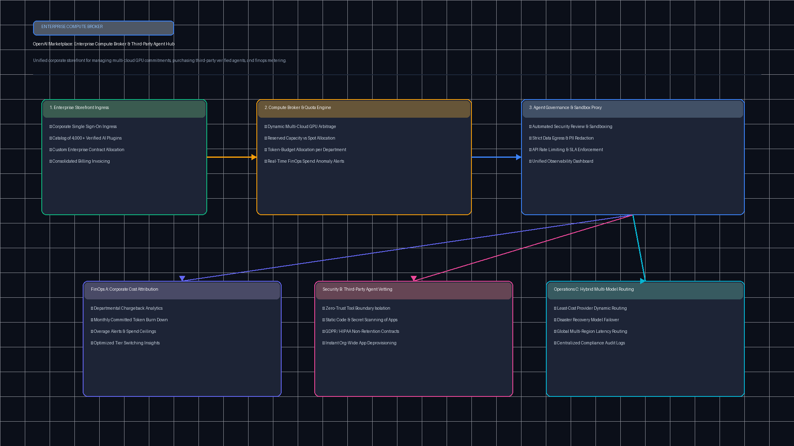
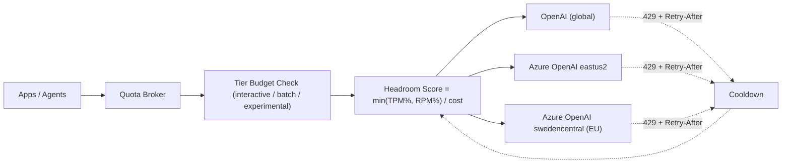

# OpenAI Compute & Quota Broker (`tp-openai-marketplace-broker`)

[](https://github.com/Pradeeptalari14/tp-openai-marketplace-broker/actions)
[](LICENSE)
[](https://python.org)

Quota-aware request routing across multiple **OpenAI** and **Azure OpenAI** deployments. Stops HTTP 429s on one deployment while others sit idle by treating them all as a single pool.

---

## 🏗️ Architecture





---

## 💻 Infrastructure & Software Technology Stack

| Layer | Technology & Tools | Production Role |
|---|---|---|
| **Multi-Cloud Ingress & Egress** | Azure OpenAI (East US 2, Sweden Central), OpenAI Global | Geographically distributed model deployments with regional quota pools |
| **Broker Runtime & Engine** | Python 3.11+, AsyncIO, Custom Sliding-Window Deque | Sub-millisecond routing decisions based on real-time headroom and cost weights |
| **Resilience & Rate-Limit Circuit**| Cooldown State Machine, Exponential Jitter Backoff | Automatic detection of HTTP 429 responses, honoring `Retry-After` headers |
| **Capacity Reservation & Tiers** | Custom Priority Allocator | Partitioned TPM allocations: Interactive (60%), Batch (30%), Experimental (10%) |
| **Compliance & Data Residency** | Regional Boundary Filters | Guarantees sensitive European data remains within Sweden Central / EU boundaries |
| **Observability & Metrics** | Prometheus Counters & Gauges, OpenTelemetry Tracing | Live tracking of tokens-per-minute (TPM) and requests-per-minute (RPM) headroom |
| **Client Protocols & Interfaces** | OpenAI Python SDK 1.50+, HTTPX Connection Pools | Drop-in proxy client compatibility for enterprise application microservices |

---

## 🚀 Features

| Feature | How it works |
|---|---|
| Sliding-window quotas | Tracks tokens and requests per deployment over the last 60s |
| Headroom routing | Picks the deployment with the most remaining capacity per unit cost |
| `Retry-After` cooldowns | A rate-limited deployment is skipped until its cooldown ends |
| Priority tiers | Interactive 60% / Batch 30% / Experimental 10% of pool TPM |
| Data residency | `region=` filter keeps EU traffic on EU deployments |

---

## 📦 Quickstart

```bash
bash scripts/validate.sh
```

```python
from quota_broker import QuotaBroker, Deployment

broker = QuotaBroker([
    Deployment("openai-primary", "global", tpm_limit=2_000_000, rpm_limit=10_000),
    Deployment("azure-eastus2", "eastus2", tpm_limit=1_000_000, rpm_limit=6_000, cost_weight=0.95),
])
d = broker.select(est_tokens=1500, tier="interactive")
if d is None:
    ...  # queue with backoff or return 429
else:
    # call the client bound to d.id, then:
    broker.record(d, tokens=1500)
    # on RateLimitError: broker.mark_rate_limited(d, retry_after_s=float(headers["retry-after"]))
```

---

## 📄 License & Security

MIT — see [LICENSE](LICENSE) and [SECURITY.md](SECURITY.md).
